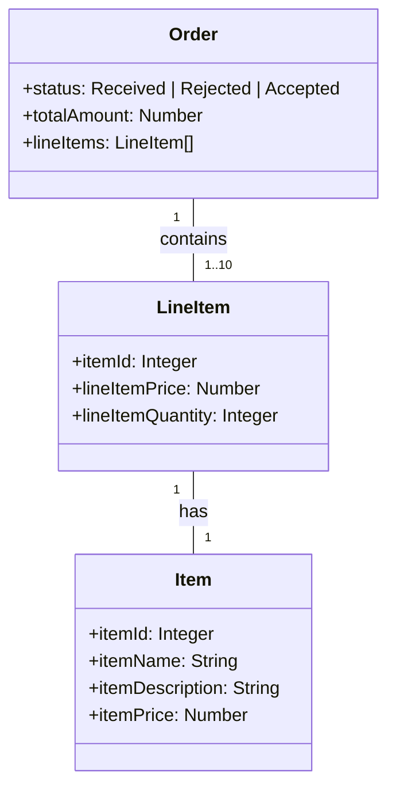

# Demo Application

## Class Diagram
Below is the class diagram of our demo application that represents orders.

This is for an e-commerce site.

```mermaid
classDiagram
    Order "1" -- "1..10" LineItem : contains
    LineItem "1" -- "1" Item : has
    class Order {
        +status: Received | Rejected | Accepted
        +totalAmount: Number
        +lineItems: LineItem[]
    }
    class LineItem {
        +itemId: Integer
        +lineItemPrice: Number
        +lineItemQuantity: Integer
    }
    class Item {
        +itemId: Integer
        +itemName: String
        +itemDescription: String
        +itemPrice: Number
    }
```