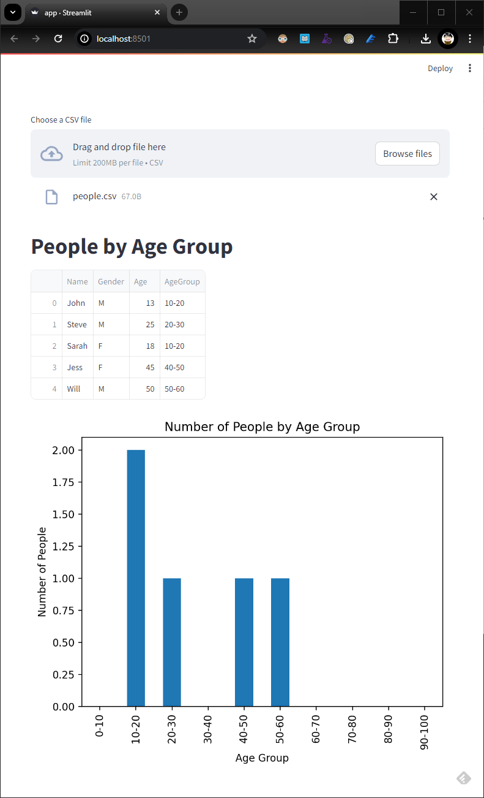

# CSV Plot

This is a simple experiment for how an AI Engineer can use GitHub Copilot in writing code. In this experiment, I used GitHub Copilot to:
1. Generate a Jupyter Notebook that reads a CSV file and plots a bar graph, and then
2. Generate a Streamlit application based on the Jupyter Notebook.
3. Used GitHub Copilot to fix a warning message in the Streamlit application.

Also see this [blog post](https://raffertyuy.com/raztype/ghcp-jupyter/).

## Jupyter Notebook
`notebook.ipynb` was generated using the following prompt
```
@workspace /newNotebook Use pandas to read the csv file in #file:people.csv and plot a bar graph by number of people by age group
```

The code generated is almost perfect, except for the file path for the csv file. The following line was changed manually:
```python
# Read the CSV file using pandas
df = pd.read_csv('C:/GitRepos/RazGPT/sampledata/people.csv')
```

## Streamlit Application
After making sure that the notebook works, I generated `app.py` using the following prompt:

```
create a streamlit application based on #file:notebook.ipynb
```

The code generated will have `people.csv` hardcoded. So I entered the following follow-up message:
```
instead of loading people.csv, replace with allowing the user to upload a csv file.
```

After making the necessary modifications, we can now run the Streamlit application using the following command:
```bash
streamlit run app.py
```

The application runs, but there is this warning message `st.cache is deprecated. Please use one of Streamlit's new caching commands, st.cache_data or st.cache_resource.`. I now try to fix this by highlighting `st.cache`, pressing `CTRL+I` and entering
```
/fix st.cache is deprecated. Please use one of Streamlit's new caching commands, st.cache_data or st.cache_resource.
```

Re-run the application. The code is now fixed.

